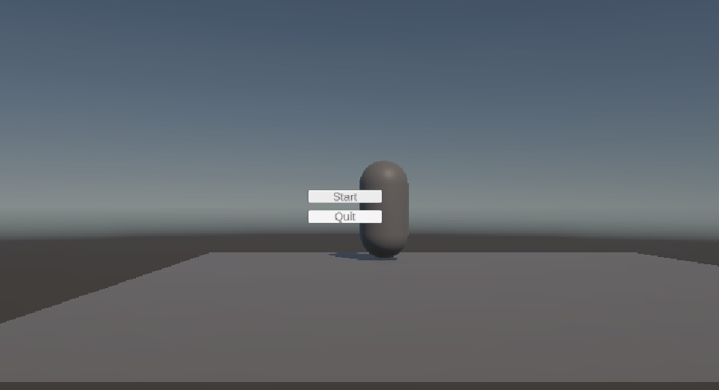
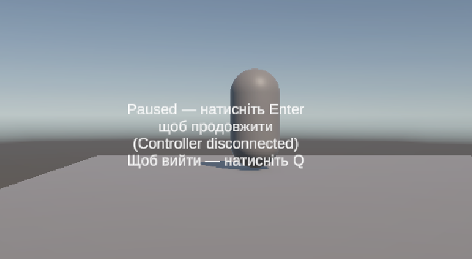

# ConsoleDemo (Unity 6 LTS, IL2CPP)

Невеликий демо-проєкт під “консольний” пайплайн: 60 FPS, навігація з/без миші, пауза/оверлей, сейв, **Safe Area**, платформена абстракція `#if UNITY_PS5/XBOX/SWITCH`, збірка **IL2CPP**.

---

## Як відкрити проєкт і сцену

1. Відкрийте **Unity Hub** → *Add project from disk* → виберіть корінь репозиторію (де є папки `Assets/`, `Packages/`, `ProjectSettings/`).
2. У вікні **Project** відкрийте сцену **`Assets/Scenes/SampleScene.unity`** (подвійний клік).
   - Якщо в Hierarchy відображається порожня сцена `Untitled`, це дефолт редактора. Просто відкрийте `Assets/Scenes/SampleScene.unity`.
3. (За потреби) Відкрийте **File → Build Settings…** і натисніть **Add Open Scenes**, щоб активна сцена гарантовано потрапила в білд.

---

## Збірка

**Вимоги:** Unity 6.0 LTS (Editor), Windows x86_64.

**Player Settings:**
- Scripting Backend: **IL2CPP**
- Api Compatibility: **.NET Standard 2.1**
- Active Input Handling: **Input System (New)**
- Target: **x86_64**
- (Опційно) **Burst AOT** → Target 64Bit CPU: **SSE2, AVX2**

**Покроково (Windows):**
1. Відкрийте `File → Build Profiles…` і переконайтеся, що вибрано **Windows (Active)**.
2. Натисніть `Open Scene List → Add Open Scenes`, щоб у списку була **SampleScene** з позначкою.
3. Зніміть прапорці **Development Build** і **Script Debugging**.
4. Натисніть **Build** і виберіть теку, наприклад: `Builds/Windows/`.
5. Запустіть `ConsoleDemo.exe`.

---

## Керування

**Меню:**
- Стрілки / WASD — навігація
- **Enter/Space** — Confirm
- **Esc** — Back / Pause

**У грі:**
- **WASD / Стрілки** — рух
- **Esc** — Pause (оверлей)
- **Enter/Space** на паузі — Resume
- **Q** на паузі — Quit

**Геймпад:**
- Підтримується **Input System (New)**. У випадку від’єднання контролера з’являється оверлей **“Paused — Controller disconnected”**.

---

## Що реалізовано (“console-ready on PC”)

- **UI без миші**: `EventSystem + Input System UI`, автофокус на першій кнопці (`UIFocus`).
- **Меню** Start/Quit + **PauseOverlay** (resume/quit, повідомлення про контролер).
- **Safe Area** для TV/overscan: `SafeAreaApplier` + контейнер `SafeArea`.
- **Сейв** у `Application.persistentDataPath/save.json` (тригер по Space/Enter).
- **0 GC.Alloc у Update()** у логіці руху (`PlayerMove`).
- **IL2CPP** Release-білд (Windows x86_64).
- **Платформена абстракція**: `Platform.Services` з `#if UNITY_PS5 / UNITY_GAMECORE / UNITY_XBOXONE / UNITY_SWITCH`.
- **Boot**: 60 FPS, VSync = 1, курсор приховано/locked, стартове повідомлення через `Platform.Services`.

---

## Де лежить сейв

- Файл: `Application.persistentDataPath/save.json`.
- На Windows:  
  `C:\Users\<ІМ’Я_КОРИСТУВАЧА>\AppData\LocalLow\<CompanyName>\<ProductName>\save.json`.

---

## Скріншоти

Меню:
<p></p>

Пауза/оверлей:
<p></p>

---

## Структура

```text
Assets/
├─ Scenes/
│  └─ SampleScene.unity
├─ Scripts/
│  ├─ Boot.cs
│  ├─ PlayerMove.cs
│  ├─ SaveSystem.cs
│  ├─ UI/
│  │  ├─ UIFocus.cs
│  │  ├─ MenuController.cs
│  │  ├─ PauseManager.cs
│  │  └─ SafeAreaApplier.cs
│  └─ Platform/
│     └─ Platform.cs
└─ Images/
   ├─ Menu.png
   └─ Pause.png
```
